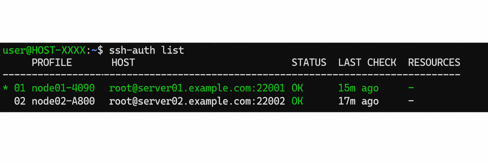

# ssh-auth

[English](README.md) | [中文](README.zh-CN.md)

用一个稳定别名 `codex-active`，在 Codex 里快速切换不同 SSH devbox。



`ssh-auth` 是一个面向 Codex 工作流的 SSH 连接管理工具。上面的图片基于实际使用截图制作，并经过 AI 匿名化处理。

## 快速开始

从仓库安装全局命令：

```shell
git clone https://github.com/fourhet66-ctrl/SSH-Auth.git ~/SSH-Auth
cd ~/SSH-Auth
./install.sh
```

如果 shell 暂时找不到命令：

```shell
source ~/.bashrc
```

初始化 SSH 配置支持：

```shell
ssh-auth init
```

直接粘贴你平时使用的 SSH 登录命令来添加服务器：

```shell
ssh-auth add gpu01 --login "ssh ubuntu@1.2.3.4 -p 22" --setup-key
```

查看、切换、检查连接：

```shell
ssh-auth list
ssh-auth switch 01
ssh-auth check
```

开启 Codex 远程连接配置：

```shell
ssh-auth config remote enable
```

在 Codex 中使用这个 SSH Host：

```text
codex-active
```

之后切换服务器只需要：

```shell
ssh-auth switch 02
```

## 你会得到什么

```text
     PROFILE     HOST                           STATUS  LAST CHECK  RESOURCES
-----------------------------------------------------------------------------
* 01 gpu01-4090  root@example.com:10317         OK      2m ago      GPU RTX 4090 24.0GB; RAM 125.8GB
  02 gpu02-A800  root@gpu.example.com:10116     OK      5m ago      GPU A800 80.0GB; RAM 251.6GB
```

- `*` 表示当前 active profile。
- `codex-active` 永远指向当前 active profile。
- `check` 会更新连接状态和服务器资源信息。
- `ssh-auth` 不保存 SSH 密码。

## 日常使用

交互式添加服务器：

```shell
ssh-auth add gpu01
```

通过登录命令添加：

```shell
ssh-auth add gpu01 --login "ssh ubuntu@1.2.3.4 -p 22"
```

添加时配置免密登录：

```shell
ssh-auth add gpu01 --login "ssh ubuntu@1.2.3.4 -p 22" --setup-key
```

如果本地密钥还不存在，可以先创建：

```shell
ssh-keygen -t ed25519 -f ~/.ssh/id_ed25519
```

也可以显式让 `ssh-auth` 调用 `ssh-keygen`：

```shell
ssh-auth add gpu01 --login "ssh ubuntu@1.2.3.4 -p 22" --setup-key --generate-key
```

查看 profiles：

```shell
ssh-auth list
```

按编号或名字切换：

```shell
ssh-auth switch 01
ssh-auth switch gpu01
```

检查连接状态：

```shell
ssh-auth check          # 当前 active profile
ssh-auth check 02       # 指定一个 profile
ssh-auth check --all    # 检查所有 profile
```

忘记名字时：

```shell
ssh-auth check list
ssh-auth check 02
```

直接打开 SSH：

```shell
ssh-auth connect 01
```

删除 profile：

```shell
ssh-auth remove 01
```

## 原理

`ssh-auth` 不修改 Codex App 的私有数据库。

它管理的是标准 OpenSSH 配置：

- Registry: `~/.codex/ssh-auth/registry.json`
- Profile snapshots: `~/.codex/ssh-auth/profiles/*.json`
- Managed SSH config: `~/.ssh/config.d/codex-ssh-auth.config`
- `~/.ssh/config` 中的 Include 行：`Include ~/.ssh/config.d/*.config`

当你运行：

```shell
ssh-auth switch gpu01
```

`ssh-auth` 会把 `gpu01` 标记为 active，并重写：

```sshconfig
Host codex-active
  HostName 1.2.3.4
  User ubuntu
  Port 22
```

这样 Codex 可以一直使用 `codex-active`，你只需要在命令行切换真实目标服务器。

## 安全说明

- 不保存 SSH 密码。
- `--setup-key` 会把密码输入交给 OpenSSH / `ssh-copy-id`。
- 不要把密码作为命令行参数传入。
- 缺失密钥时不会自动生成，除非显式传入 `--generate-key`。
- Registry 文件可能包含 hostname、username、port、key path、检查时间和资源摘要。不要提交真实的 `~/.codex/ssh-auth` 目录。
- 生成的 profile 和 registry 文件会尽量使用私有权限。

## 开发

不安装，直接从仓库运行：

```shell
./ssh-auth --help
python3 -m ssh_auth --help
```

运行测试：

```shell
python3 -m unittest discover -q
python3 -m compileall ssh_auth tests
```

隔离状态测试：

```shell
SSH_AUTH_HOME=/tmp/ssh-auth-state \
SSH_AUTH_SSH_DIR=/tmp/ssh-auth-ssh \
CODEX_HOME=/tmp/codex-home \
./ssh-auth list
```

## 致谢

`ssh-auth` 受到 [`codex-auth`](https://github.com/loongphy/codex-auth) 启发，尤其是它简洁的账号切换工作流和终端优先的交互方式。
